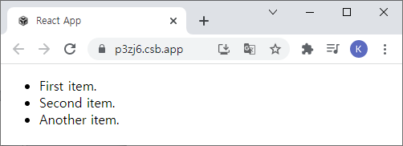
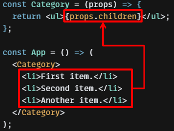

# Props Drilling이란 무엇인가요?

## 답변

- React의 컴포넌트 트리에서 데이터를 전달하기 위해서 필요한 과정을 의미합니다.
- 예를 들어 우리가 `App.js`에서 데이터를 하위 컴포넌트까지 쭉 전달하려면 데이터가 변경되었을 때 일일히 고쳐야하는 불편함이 있습니다.
- 이를 해결하기 위해 전역 상태 관리 라이브러리인 `Recoil`, `Redux` 등을 이용하여 해당 값이 필요한 컴포넌트에게 직접 불러서 사용하는 해결방안이 있습니다.

---

## 1. Props Drilling

- props를 오로지 하위 컴포넌트로 전달하는 용도로만 쓰이는 컴포넌트를 거치면서 React Component 트리의 한 부분에서 한 부분으로 데이터를 전달하는 과정

- 예시 코드

  ```javascript
  import React from "react";
  import "./styles.css";

  export default function App() {
    return (
      <div className="App">
        <FirstComponent content="Who needs me?" />
      </div>
    );
  }

  function FirstComponent({ content }) {
    return (
      <div>
        <h3>I am the first component</h3>;
        <SecondComponent content={content} />|
      </div>
    );
  }

  function SecondComponent({ content }) {
    return (
      <div>
        <h3>I am the second component</h3>;
        <ThirdComponent content={content} />
      </div>
    );
  }

  function ThirdComponent({ content }) {
    return (
      <div>
        <h3>I am the third component</h3>;
        <ComponentNeedingProps content={content} />
      </div>
    );
  }

  function ComponentNeedingProps({ content }) {
    return <h3>{content}</h3>;
  }
  ```

  - `ComponentNeedingProps` 컴포넌트에서 해당 props를 사용하기 위해 content를 전달하는 과정
  - `App` > `FirstComponent` > `SecondComponent` > `ThirdComponent` > `ComponentNeedingProps`

<br>

## 2. Props Drilling의 문제점

- props 전달이 3~5개 정도 컴포넌트라면 Props Drilling은 문제가 되지 않음
- props 전달이 10개, 15개 같이 더 많은 과정을 거치게 된다면 코드를 읽을 때 해당 props를 추적하기 힘들어짐

<br>

## 3. Props Drilling 해결방법

### 3.1. 전역 상태관리 라이브러리 사용

- `recoil`, `redux`, `MobX` 등을 사용하여 해당 값이 필요한 컴포넌트에서 직접 불러서 사용

<br>

### 3.2. Children을 적극적으로 사용

#### 3.2.1. Children이란?

- 태그와 태그 사이의 모든 내용을 표시하기 위해 사용되는 특수한 Props
  > 어떤 컴포넌트들은 어떤 자식 엘리먼트가 들어올지 미리 예상할 수 없는 경우가 있다. 범용적인 “박스” 역할을 하는 sidebar 혹은 Dialog와 같은 컴포넌트에서 특히 자주 볼 수 있다.
      - 공식문서
  >

<br>

#### 3.2.2. 예제 코드

```javascript
cosnt Category = (props) => {
  return <ul>{props.children}</ul>
}
```

```javascript
cosnt Category = ({children}) => {
	return <ul>{children}</ul>
}
```

```javascript
const App = () => (
  <Category>
    <li>First item.</li>
    <li>Second item.</li>
    <li>Another item.</li>
  </Category>
);
```



<br>

#### 3.2.3. 동작 과정



<br>

#### 3.2.4. props.children의 필요성

- 주로 자식 컴포넌트 또는 html 엘리먼트가 어떻게 구성되어있는지 모르는데 화면에 표시해야 하는 경우 사용
- ex) \<Category> ~ \</Category> 안에 \<li>가 몇 개 작성될지 모른다면 효율적으로 사용 가능

  ```javascript
  const App =() => {
    <Category>
      {/* li 태그가 0개일 수도 있고 여러 개일 수도 있습니다.*/}
      <li>First item.</li>
      <li>Second item.</li>
      <li>Another item.</li>
    </Category>
  }
  ```

<br>

#### 3.2.5. props.children의 주의점

- 태그와 태그 사이의 모든 요소들을 자식취급하지 않는 것
- ex) 아래 코드에서 Category 컴포넌트의 자식 요소는 \<ul> 엘리먼트

  ```javascript
  const li_Array = ["First item.", "Second item."];

  const App = () => (
    <Category>
      <ul>
        {li_Array.map((value, idx) => (
          <li key={idx}>{value}</li>
        ))}
      </ul>
    </Category>
  );
  ```
    - < ul > ~ < /ul > 사이에 있는 < li > 엘리먼트는 < Category > 기준으로는 자손

<br>

#### 3.2.6. children 사용으로 리팩토링

```javascript
import React from "react";
import "./styles.css";

export default function App() {
  const content = "Who needs me?";
 return (
    <div className="App">
      <FirstComponent>
        <SecondComponent>
          <ThirdComponent>
            <ComponentNeedingProps content={content}  />
          </ThirdComponent>
        </SecondComponent>
      </FirstComponent>
    </div>
  );
}

function FirstComponent({ children }) {
  return (
    <div>
      <h3>I am the first component</h3>;
     { children }
    </div>
  );
}

function SecondComponent({ children }) {
  return (
    <div>
      <h3>I am the second component</h3>;
     {children}
    </div>
  );
}

function ThirdComponent({ children }) {
  return (
    <div>
      <h3>I am the third component</h3>
        {children}
    </div>
  );
}

function ComponentNeedingProps({ content }) {
  return <h3>{content}</h3>
}
```
