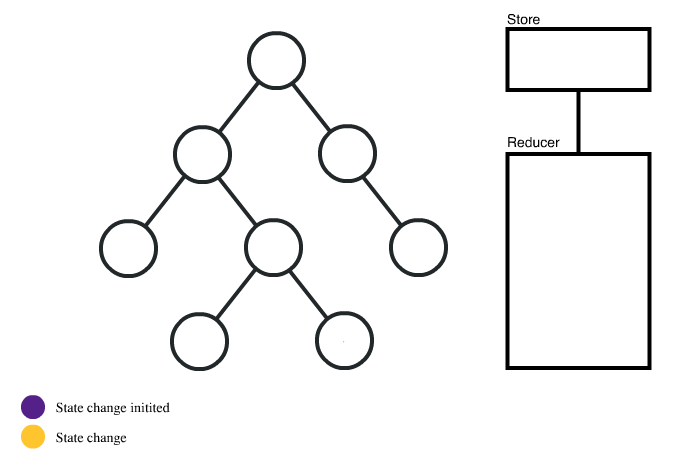

# 여러가지 상태 관리 라이브러리(Redux, Recoil, MobX 등)의 차이점에 대해서 설명하세요.

## 답변

Redux와 Recoil은 둘 다 상태관리 라이브러리입니다. Redux는 중앙 집중식 저장소와 액션 기반 아키텍처를 사용하며, 액션을 디스패치하여 상태를 변경합니다. 반면 Recoil은 분산된 상태를 관리하며, 컴포넌트 내에서 직접적으로 상태를 읽고 쓸 수 있습니다. Redux는 기존에 많이 사용되고 널리 알려져 있지만, Recoil은 상대적으로 최근에 소개되었으며, 훨씬 간편하고 유연한 API를 제공합니다.

---

## 1. 상태관리 라이브러리의 필요성

- **단방향 바인딩**
    - 부모 컴포넌트에서 자식 컴포넌트로만 `state`를 props로 전달 가능
    - 자식 컴포넌트에서 부모 컴포넌트로 `props`를 직접 전달할 수 X
    
    
    
- 자식 컴포넌트에서 부모 컴포넌트에 있는 state를 변경하려면 `setState`를 props로 넘겨줘야 함
    
    → 반복되면 **Props Drilling** 발생
    
 

## 2. Redux

- 여러 컴포넌트에 사용되는 `state`를 분리 통합하여 관리할 수 있게 하고 애플리케이션의 안정성을 높일 수 있는 라이브러리

- **Action**
    - Redux에서는 상태를 업데이트하기 위해 Action이라는 객체를 사용
    - 액션 타입(type)과 선택적 데이터(payload)를 가지며, 앱에서 어떤 변화가 일어났는지 기술
- **Dispatch**
    - 액션을 전달하고, 이에 대한 상태 업데이트를 Reducer에 요청
- **Reducer**
    - 상태를 변경하는 로직이 작성되는 곳
    - 변화를 일으키는 함수로, Action의 결과로 `state`를 어떤 식으로 바꿀지 구체적으로 정의하는 부분
    - 현재 상태와 전달받은 액션 객체를 파라미터로 받아서 새로운 상태로 반환
    - 파라미터 외의 값을 의존하면 안되고, 이전 상태는 건드리지 않은 상태로 새로운 상태 객체를 만들어 반환하는 순수 함수여야 함
- **Store**
    - Redux에서는 앱의 상태를 하나의 객체에 저장하는데, 이 객체를 Store라고 함
    - 앱의 모든 상태 정보는 이 Store 객체 안에 저장되며, 앱 내부의 어느 곳에서든 접근할 수 있음
    - 프로젝트에 리덕스를 적용하기 위해 필요한 것으로 프로젝트에는 단 한 개의 Store만 가지며 상태의 중앙 저장소라고 할 수 있음

 

### 2.1. Redux 특징

- 상태를 전역적으로 관리하기 때문에 어느 컴포넌트에 상태를 둬야할지 고민할 필요X
- 데이터 흐름을 단방향으로 흐르게 함
- flux 아키텍처를 따름
- 개념에 대한 이해가 선행되어야 하고, 여러 라이브러리를 함께 사용하는 경우가 있기 때문에 러닝커브가 높은 편
- 액션을 하나 추가하는데, 작성 필요한 부분이 많고, 컴포넌트와 스토어를 연결하는 필수적인 부분들이 있어 코드량이 많아질 수 있음

 

## 3. Recoil

- **Context API** 기반으로 구현된 함수형 컴포넌트에서만 사용 가능한 라이브러리
- Hooks나 Context API와 같은 React에 내장된 상태 관리 기능을 사용하여 상태관리를 할 수 있지만, 아래와 같은 한계 존재
    - 컴포넌트 상태를 공통된 상위 컴포넌트까지 끌어올려 공유할 수 있지만, 이 과정에서 거대한 트리가 리렌더링 되기도 함
    - Context는 단일 값만 저장 가능하고, 자체 Consumer를 가지는 여러 값들의 집합을 담는 것은 불가
    - `state`가 존재하는 곳부터 `state`가 사용되는 곳까지 코드 분할이 어려움

- React스러움을 유지하며 개선하는 방식의 라이브러리
- 방향 그래프를 정의하고 리액트 트리에 붙이는데, 그래프의 뿌리(`atom`)로 부터 순수 함수(`selector`)를 거쳐 컴포넌트로 흐름

- **Atom**
    - 상태의 단위로, 유니크한 키값으로 구분됨
    - 해당 Atom을 구독하고 있으면, 해당 컴포넌트들만 선택적으로 리렌더링
    - Atom의 상태변화는 순수함수를 통해 일어나는데 이를 `Selector`라고 함
- **Selector**
    - 비동기 처리 뿐만 아니라 데이터 캐싱 기능도 제공하기 때문에 비동기 데이터를 다루기에 용이

 

### 3.1. Atoms와 Selector

- **Atoms**
    - Recoil에서 **상태의 단위**를 의미
    - 업데이트와 구독이 가능
    - atom이 업데이트되면 각각의 구독된 컴포넌트는 새로운 값을 반영해서 리렌더링
    - React의 로컬 `state` 대신 사용 가능
    - 동일한 atom이 여러 컴포넌트에서 사용되는 경우 모든 컴포넌트는 상태를 공유
    - Atoms에는 고유한 키가 필요하고 이 키는 전역적으로 고유해야 함
    - React state처럼 default 값 가짐
    - 컴포넌트에서 atom을 읽고 쓸 때는 `useRecoilState`라는 훅을 사용해야 함
        - React의 `useState`와 비슷하나, 상태가 컴포넌트 간에 공유될 수 있다는 점에서 차이가 있음
    
- **Selector**
    - atoms나 다른 selectors를 입력으로 받는 **순수 함수(pure function)**
    - 상위 atoms나 selectors가 업데이트 될 경우 하위 selectors도 재실행됨
    - 컴포넌트는 atom 뿐만 아니라 selectors를 구독할 수 있고, 구독하고 있는 selectors가 변경되면 구독한 컴포넌트도 리렌더링
    - 상태를 기반으로 데이터를 계산하고 최소한의 상태 집합만 atoms에 저장하고, 파생 데이터는 selector에서 계산하면서 불필요한 상태를 만들어내지 않음
    - 컴포넌트 관점에서 atoms와 selectors는 동일한 인터페이스이므로 대체 가능
    - `useRecoilValue()`를 통해 조회 가능
    - `useRecoilState`와는 다르게 writable 하지 않고, 반환 값의 조회만 가능
    - 필요하다면 writable한 selector 작성도 가능

 

### 3.2. Recoil 특징

- 비동기 처리를 기반으로 작성되어 동시성 모드를 제공하기 때문에, Redux와 같은 다른 비동기 처리 라이브러리에 의존할 필요 X
- **Concurrent Mode**
    - 흐름이 여러 개가 존재하는 경우
    - React에서 렌더링의 동작 우선순위를 정하여 적절한 때 렌더링
- `atom` → `selector`를 거쳐 컴포넌트로 전달되는 하나의 data-flow를 가지고 있어, 복잡하지 않은 상태 구조를 가짐
- `atom`과 `selector`만 알고도 어느 정도 구현이 가능하기 때문에 러닝커브가 비교적 낮음
- store와 같은 외부 요인이 아닌 React 내부의 상태를 활용하고 context API를 통해 구현되어있기 때문에 더 React에 가까운 라이브러리

 

## 4. Context API

- React가 자체적으로 가지고 있음
- 정적인 데이터 위주로 처리하거나 업데이트가 자주 발생하지 않을 때 사용하기 적합
- 복잡한 업데이트를 처리할 때에는 비효율적
    - Provide로 감싸진 부분의 업데이트가 되지 않은 state에도 리렌더링이 발생하기 때문
- 이를 보완하기 위해 **Recoil**이란 라이브러리 나옴

 

## 5. Redux, Recoil, MobX, Zustand, Jotai 특징 및 기능 비교

### 5.1. 특징 비교

| 특징 | Redux | Recoil | MobX | Zustand | Jotai |
| --- | --- | --- | --- | --- | --- |
| 데이터 흐름 | 단방향 데이터 흐름 패턴을 사용 | 단방향 데이터 흐름 패턴을 사용 | 양방향 데이터 바인딩 패턴을 사용 | 단방향 데이터 흐름 패턴을 사용 | 단방향 데이터 흐름 패턴을 사용 |
|  데이터 변화 감지 | 액션(Action)을 통해 변화를 감지 | 변화를 감지하는 상태 Atom을 사용 | 오브젝트를 Observer로 사용함 | React Hooks를 통해 상태 변화를 감지함 | React Hooks를 통해 상태 변화를 감지함 |
| 비동기 처리 | Redux-Thunk, Redux-Saga와 같은 미들웨어를 사용함 | 비동기 처리를 위한 별도의 라이브러리가 필요하지 않음 | MobX-React와 같은 미들웨어를 사용함 | 비동기 처리를 위한 별도의 라이브러리가 필요하지 않음 | 비동기 처리를 위한 별도의 라이브러리가 필요하지 않음 |
|  러닝 커브 | Redux는 개념이 간결하고 직관적이지만 초기 학습이 어려움 | Recoil은 개념이 간결하고 초기 학습이 상대적으로 용이함 | MobX는 초기 학습이 비교적 용이함 | Zustand은 상태 관리와 관련된 개념이 간결하며 초기 학습이 상대적으로 용이함 | Jotai는 초기 학습이 비교적 용이함 |
| 커뮤니티 | 널리 사용되고 활발한 커뮤니티가 있음 | 아직은 상대적으로 새로운 상태 관리 도구이기 때문에 커뮤니티는 활발하지 않음 | 커뮤니티가 활발하지만 Redux보다는 작음 | 커뮤니티는 활발하지만 Redux보다는 작음 | 커뮤니티는 활발하지만 Redux보다는 작음 |

 

### 5.2. 기능 비교

| 기능/도구 | Redux | Recoil | MobX | Zustand | Jotai |
| --- | --- | --- | --- | --- | --- |
| 코드 크기 | 큼 | 중간 | 작음 | 중간 | 작음 |
| 비동기 처리 | 미들웨어 필요 | 필요 없음 | 미들웨어 필요 | 필요 없음 | 필요 없음 |
| 데이터 흐름 | 단방향 | 단방향 | 양방향 | 단방향 | 단방향 |
| 초기 학습 용이 | 어려움 | 쉬움 | 쉬움 | 쉬움 | 쉬움 |
| 코드 간결성 | 중간 | 높음 | 높음 | 높음 | 높음 |
| 유지 보수성 | 높음 | 높음 | 중간 | 높음 | 높음 |
| 상태 구성 | 객체 | Atom | 객체 | 객체 | Atom |
