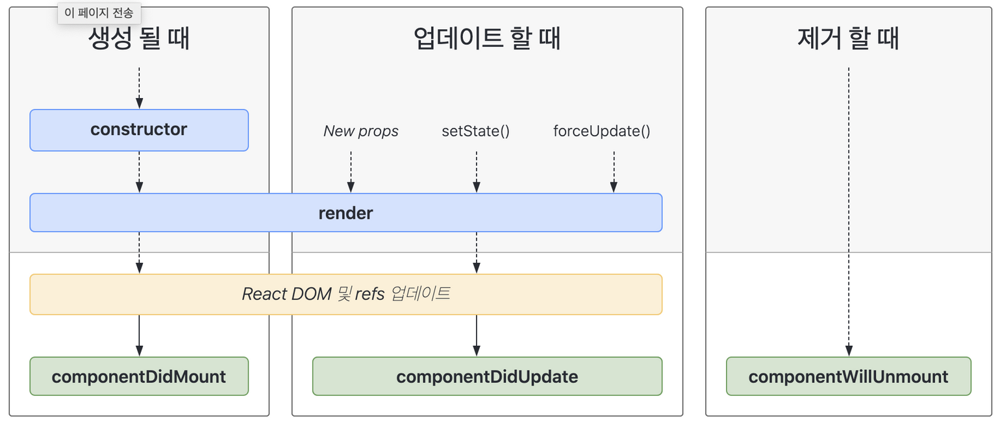

# React에 있는 라이프사이클과 각 라이프사이클의 역할을 설명하세요.

## 답변

- 리액트의 라이프사이클은 크게 4가지로 설명할 수 있습니다.
- 최초로 컴포넌트 객체가 생성될 때 한 번 수행되어지는 `componentDidMount()`와 초기에 화면을 그려줄 때와 업데이트가 될 때 호출되는 `render()`가 있습니다.
- 그리고 컴포넌트의 속성 값 또는 상태값이 변경되면 호출되어지는 `componentDidUpdate()`와 마지막으로 컴포넌트가 소멸될 때 호출되어지는 `componentWillUnmount()`가 라이프사이클의 역할입니다.

---

## 1. React의 생명주기


- 컴포넌트의 생명주기 : 생성(mounting) → 업데이트(updating) → 제거(unmounting)
- React class 컴포넌트 → **라이프 사이클 메서드** 사용
- 함수형 컴포넌트 → **Hook** 사용


## 2. Class Component의 생명주기

### 2.1. 마운드(mount)

- 컴포넌트가 생성될 때 발생하는 생명주기

<br>

✅ **constructor**

- 컴포넌트 생성자 메서드, 컴포넌트가 생성되면 가장 먼저 실행되는 메서드
- this.props, this.state에 접근이 가능하고 리액트 요소를 반환

<br>

✅ **getDerivedStateFromProps**

- props로부터 파생된 state를 가져옴
- props로 받아온 것을 state에 넣어주고 싶을 때 사용

<br>

✅ **render**

- 컴포넌트를 렌더링하는 메서드

<br>

✅ **componentDidMount**

- 컴포넌트가 마운트 됨, 즉 컴포넌트의 첫 번째 렌더링이 마치면 호출되는 메서드
- 이 메서드가 호출되는 시점에는 화면에 컴포넌트가 나타난 상태
- 여기서는 주로 DOM을 사용해야 하는 외부 라이브러리 연동, 해당 컴포넌트에서 필요로하는 데이터를 ajax로 요청 등의 행위를 함
    
    ```javascript
    useEffect(()=>{
    	console.log("componentDidMount");     
    },[])
    ```
    
<br>

### 2.2. 업데이트(updating)

- 컴포넌트가 업데이트되는 시점

<br>

✅ **getDerivedStateFromProps**

- 컴포넌트의 props나 state가 바뀌었을때도 이 메서드가 호출됨

<br>

✅ **shouldComponentUpdate**

- 컴포넌트가 리렌더링 할지 말지를 결정하는 메서드
    - `React.memo`와 유사함, boolean 반환으로 결정

<br>

✅ **componentDidUpdate**

- 컴포넌트가 업데이트 되고 난 후 발생
    - 의존성 배열이 변할때만 useEffect가 실행하는 것과 같음
    
    ```jsx
    useEffect(() => {
    	console.log("count or exampleProp changed");     
    },[count, exampleProp]);
    ```
    
<br>

### 2.3. 언마운트(unmount)

- 컴포넌트가 화면에서 사라지는 것을 의미
- 언마운트에 관련된 생명주기 메서드는 `componentWillUnmount` 하나임

<br>

✅ **componentWillUnmount**

- 컴포넌트가 화면에서 사라지기 직전에 호출
- 여기서 주로 DOM에 직접 등록했었던 이벤트를 제거하고, 만약에 `setTimeout`을 걸은 것이 있다면 `clearTimeout`을 통하여 제거
- 추가적으로, 외부 라이브러리를 사용한게 있고 해당 라이브러리에 dispose기능이 있다면 여기서 호출하면 됨
    
    ```jsx
    useEffect(()=>{
    	console.log("");     
        return(() => exampleAPI.unsubscribe());
    })
    ```
    
<br>    

## 3. Functional Component 생명주기

- 리액트에서 Hook은 함수형 컴포넌트에서 React state와 생명주기 기능을 연동 할 수 있게 해주는 함수
- Hook은 class 안에서는 동작하지 않고, class없이 React를 사용할 수 있게 함

<br>

### 3.1. React Hook을 도입한 목적

- 기존의 라이프사이클 메서드 기반이 아닌 로직 기반으로 나눌 수 있어서 컴포넌트를 함수 단위로 잘게 쪼갤 수 있음
- 라이프사이클 메서드에는 관련 없는 로직이 자주 섞여 들어가는데, 이로인해 버그가 쉽게 발생하고, 무결성을 쉽게 해침

<br>

### 3.2. **Hook 사용 규칙 두가지**

- 최상위 에서만 Hook을 호출해야 함
    - 반복문, 조건문, 중첩된 함수 내에서 Hook을 실행하면 안됨
    - 이 규칙을 따르면 컴포넌트가 렌더링될 때마다 항상 동일한 순서로 Hook이 호출되는 것이 보장됨
- 리액트 함수 컴포넌트에서만 Hook을 호출해야 함
    - 일반 JS함수에서는 Hook을 호출해서는 안됨

<br>

### 3.3. **Hook의 종류와 정리**

✅ **useState**

- 상태를 관리
    - `[state이름, setter이름]` 순으로 반환 받아서 사용
    
    ```javascript
    const [state, setState] = useState(initialState);
    ```
    
<br>    

✅ **useEffect**

- 화면에 렌더링이 완료된 후에 수행되며`componentDidMount`와 `componentDidUpdate`, `componentWillUnmount`가 합쳐진 것
    
    ```javascript
    useEffect(() => {}); // 렌더링 결과가 실제 돔에 반영된 후마다 호출
    useEffect(() => {}, []); // 컴포넌트가 처음 나타날때 한 번 호출
    useEffect(() => {}, [의존성1, 의존성2, ..]); // 조건부 effect 발생, 의존성 중 하나가 변경된다면 effect는 항상 재생성됨
    ```
    
    - `useEffect(() => {}, [])`
        - `componentDidMount`와 같은 역할
        - React에서 이렇게 작성하는 것은 문제가 없으나 TypeScript와 ESLint를 사용하는 경우 에러가 발생할 수 있음

<br>  

✅ **useCallback**

- 메모이제이션 된 콜백을 반환
- useMemo와 유사하게 이용되며 '함수'에 적용해줌
- 의존성이 변경되었을때만 변경되고, 이 때문에 특정 함수를 새로 만들지 않고 재사용가능하게 함
    
    ```javascript
    const memoizedCallback = useCallback(
      () => {
        doSomething(a, b);
      },
      [a, b],
    );
    ```
