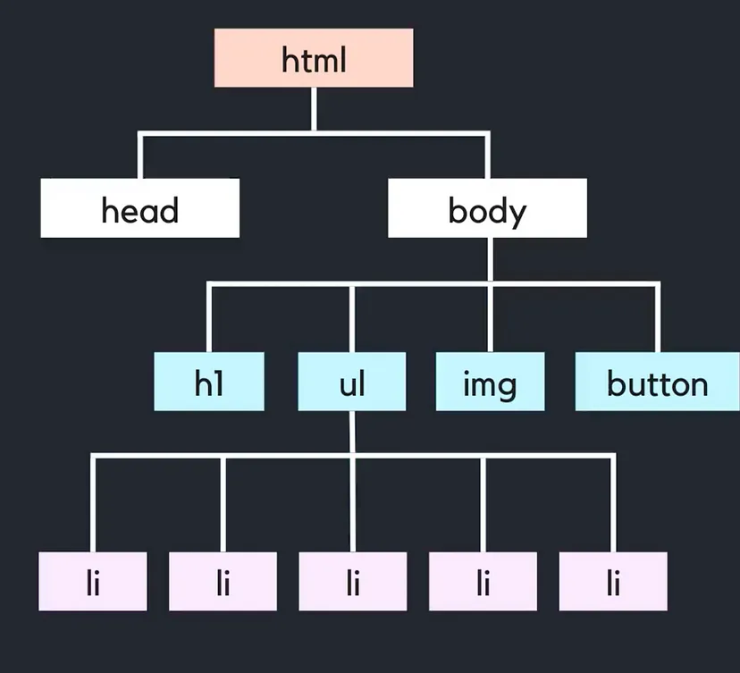
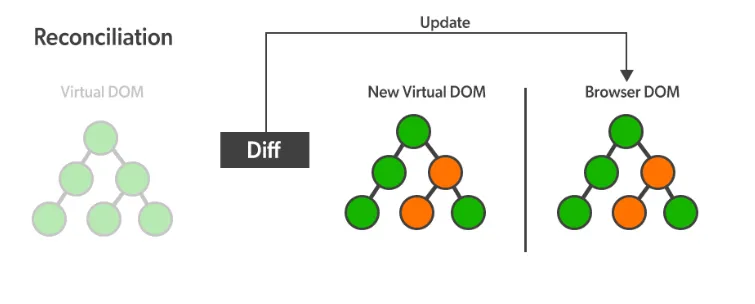

# virtual DOM이 무엇인가요? virtual DOM이 좋은 이유에 대해서 설명하세요.

## 답변

### Virtual DOM
- 실제 DOM 변화를 최소화 시켜주는 역할

### Virtual DOM의 장점
- virtual DOM을 사용하는 이유는 효율성 때문
- virtual DOM을 활용하면 실제 DOM을 바꾸는 것보다 시간 복잡도가 낮아짐
- 만약, HTML 파일에 20개의 변화가 생기면 과정 역시 20회가 이루어짐
    - 하지만 virtual DOM은 변화된 부분만 가려내어 실제 DOM에 전달하기에 실제 DOM은 1회로 인식하여 단 한번만의 렌더링 과정만 거치게 됨

---

## 1. DOM이란?
- 실제 DOM 변화를 최소화 시켜주는 역할
- DOM(Document Object Model)
- 하나하나의 Element(HTML)들을 담고 있는 웹페이지를 Document라고 하는데, 이를 브라우저는 분석해 페이지를 띄워주는 방식
- DOM이란 이런 HTML elements들을 tree 형태로 표현한 것
    
    
    
- DOM tree 안에는 각각의 element에 상응하는 Node가 들어있음
- DOM 조작
    - 개발자들은 DOM이 제공하는 API를 통해 DOM 구조에 접근을 하고, 원하는 Element를 입맛대로 조작
    - `getElementById`, `querySelector` 같은 API를 통해 DOM 구조 안의 Element에 접근해 원하는대로 내용, 스타일, 레이아웃 등을 수정

<br>

## 2. Virtual DOM이란?

- 실제 DOM과 같은 내용을 담고 있는 복사본
    - 복사본은 실제 DOM이 아닌 JS 객체형태로 메모리 안에 저장되어 있음
- Virtual DOM은 실제 DOM의 복사본이기 때문에, 실제 DOM의 모든 element와 속성을 공유
- 차이점
    - 브라우저에 있는 문서에 직접적으로 접근할 수 없음
    - 화면에 보여지는 내용을 직접 수정할 수 없음

<br>

## 3. Virtual DOM 사용하는 이유

- React에서 Virtual DOM을 사용하여 실제 DOM을 조작하는데 걸리는 시간을 획기적으로 줄임
- DOM 조작 예시
    - 폰트의 컬러만 바꾸고 싶어도, 다음과 같이 DOM 조작을 필요로 함
        
        ```javascript
        document.querySelector("$title").style.color="red";
        ```
        
    - 브라우저는 HTML을 탐색해 해당 Element를 찾고, 해당 Element와 자식 Element들을 DOM에서 제거
    - 이후 새롭게 수정된 Element로 이를 교체
    - CSS는 이 과정 이후 다시 계산하여 결과적으로 레이아웃 정보를 알맞게 수정하게 되는 것
    - 새롭게 계산된 내용이 브라우저에 그려지는 방식으로 플로우가 진행됨

<br>

- **DOM의 문제점**
    - DOM 조작은 트리에 있는 정보를 업데이트시켜준다는 점, 빠른 알고리즘을 사용한다는 조건 하에서 퍼포먼스적으로 무리가 있는 작업은 아님
    - 하지만 이를 반복적으로 수행한다면 충분히 무거워질 수 있는 작업
    - 이렇게 등장한 개념이 Virtual DOM

<br>

- **Virtual DOM 장점**
    - Virtual DOM은 실제 DOM과 내용을 공유하는 복사본이지만 실제 DOM과 다르게 직접적으로 브라우저 화면의 UI를 조작할 수 있게 해주는 API는 제공하지 않음
    - Virtual DOM은 메모리에 저장되어 있는 JavaScript 객체에 불과하기 때문
    - Virtual DOM에 접근하고 수정하는 것은 매우 가볍고 빠른 작업
        - 실제 브라우저에 접근하는 것이 아니기 때문!

<br>

## 4. React에서 Virtual DOM을 사용하는 방식

- React에서 가지고 있는 Virtual DOM
    
    (1) 렌더링 이전 화면 구조를 나타내는 Virtual DOM
    
    (2) 렌더링 이후에 보이게 될 화면 구조를 나타내는 Virtual DOM
    
<br>

- React는 state가 변경될 때마다 Re-Rendering이 발생
    - 실제 브라우저가 그려지기 이전에 Re-Rendering 시점마다 새로운 내용이 담긴 Virtual DOM을 생성



- **Diffing**
    - 렌더링 이전에 화면의 내용을 담고 있는 첫 번째 Virtual DOM과 업데이트 이후에 발생할 두 번째 Virtual DOM을 비교해 정확히 어떤 Element가 변했는지 비교
    - Diffing은 효율적인 알고리즘을 사용해 진행되기 때문에 어떤 Element에 차이가 있는지 매우 신속하게 파악할 수 있음
- **Reconciliation(재조정)**
    - React는 이를 통해 차이가 발생한 부분만을 (브라우저상의) 실제 DOM에 적용
    - **Batch Update**
        - 변경된 모든 Element들을 집단화시켜 이를 한번에 실제 DOM에 적용하는 방식
        - EX) 리스트 안에 10개의 항목이 바뀌었다면 실제 DOM을 10번 반복해 수정하는 것이 아닌, 한 번에 집단화시켜 이를 적용함
        - DOM 조작에 비용이 가장 많이 발생하는 지점은 브라우저에 화면을 그려주는 작업
        - Batch Update는 변경된 Element를 별개로 그려주는 것이 아닌, 변경된 내용을 한 번에 받아와 이를 실제 DOM에 한 번에 적용시켜줌 → 효율적