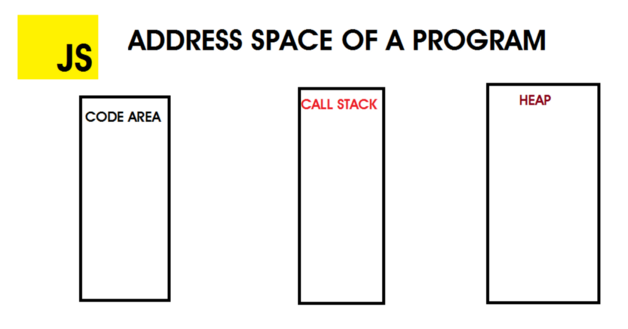
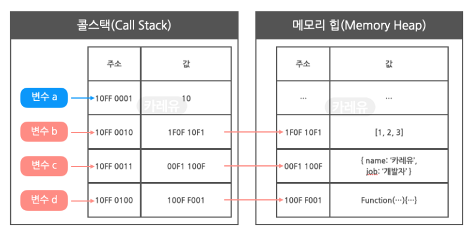
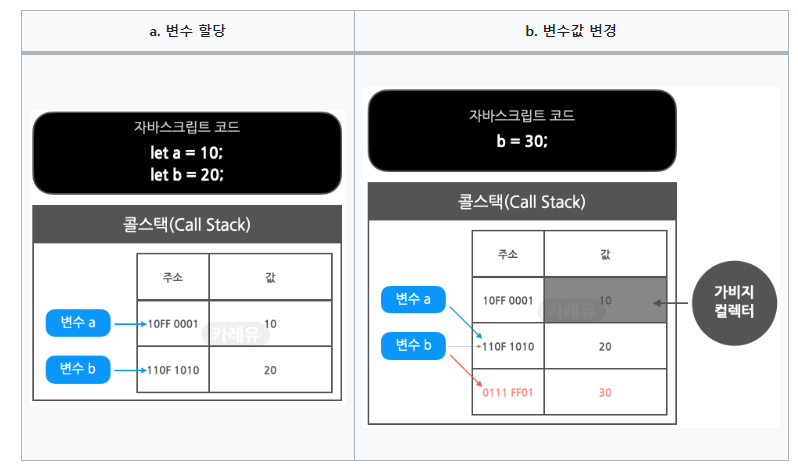
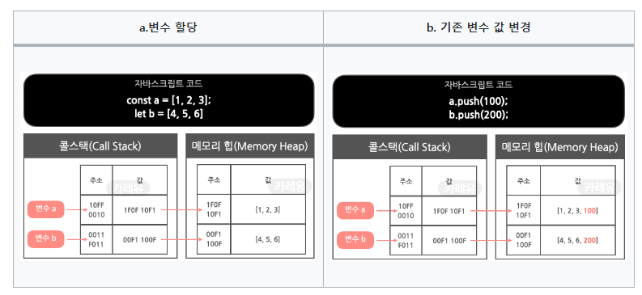

# React에서 상태 변화가 생겼을 때, 변화를 어떻게 알아채는지에 대해서 설명하세요.

## 답변

- React는 상태를 **불변성**을 띄게 변경합니다. 
- 그로 인해 상태 객체의 주소값이 변경되면 변화가 되었다는 것을 알 수 있습니다.

---

## 1. JavaScript 메모리 구조




- 자바스크립트 엔진은 **call stack**과 **heap memory** 2가지 메모리 공간을 가짐
    - **call stack**
        - 실행 중인 함수를 추적해 계산을 수행하고, **지역변수를 저장**하는 공간
        - **원시 타입들이 저장됨**
    - **heap memory**
        - **참조 타입들이 할당되는 곳**
        - 메모리 누수를 방지하기 위해 js 엔진의 메모리 관리자가 항상 관리하는 공간

<br>

- 원시 타입(Primitive types) : Boolean, String, Number, Null, Undefined, Symbol, BigInt
- 참조 타입(Reference types) : Object, Array, Function, Date

<br>

## 2. 원시 타입과 참조 타입의 데이터 저장방식과 재할당 비교

### 2.1. 원시 타입과 참조 타입의 데이터 저장방식



- **원시 타입**
    - 변수 a에 값 10을 저장했을 경우, **콜 스택의 변수값에 10이 그대로 저장**
        
        ```javascript
        const a = 10  // 변수 "a"는 값 10을 직접 저장
        ```
        
- **참조 타입**
    - 변수 b, c, d,에 array나 object를 저장할 경우, **실제 값은 메모리 힙에 저장**되고, **메모리 힙의 주소가 콜 스택의 값에 저장**
        
        ```javascript
        const b = [1, 2, 3]  // "b"는 배열 [1, 2, 3]이 저장된 메모리 힙의 주소를 가리킴
        ```

<br>        

### 2.2. 원시 타입과 참조 타입의 재할당 비교

- 원시 타입의 특징
    
    
    
    - 변수값을 변경하라는 명령을 받을 경우, **기존 콜스택의 값을 변경하지 않고 새로운 주소를 추가해 값을 저장하고 변수 b가 바라보게 함**
        - **불변성** - 메모리 영역의 값은 변경되지 X
    - 더이상 참조되지 않는 데이터는 가비지 컬렉터에 의해 적절한 시점에서 메모리가 해제됨
    - 예시
        
        ```javascript
        let a = 10;
        let b = a; // b = 10
        a = 20;    // a = 20
        console.log(b); // b = 10
        ```

<br>

- 참조 타입의 특징
    
    
    
    - 원시타입처럼 불변성이 지켜지지 X
    - 변수 a, b가 바라보고 있는 **콜스택의 값이 변경되지 않고, 메모리 힙에 있는 데이터가 변경되어 불변성이 유지되지 X**

<br>

## 3. React에서 불변성을 지켜야 하는 이유

- 불변성을 지킨다 = 메모리 영역에서 값을 변경할 수 없게 한다
    - **리액트의 state 변화 감지 기준은 콜 스택의 주소값이기 때문**

<br>

- **얕은 비교**
    - 리액트는 콜 스택의 주소값만을 비교해 상태 변화를 감지
    - 리액트의 state를 빠르게 감지할 수 있는 장점이자 불변성을 유지해야 하는 이유

<br>

- **원시 타입**의 경우 값을 재할당할 경우 새로운 메모리가 할당되어 콜 스택의 주소 값이 감지됨
- **참조 타입**의 경우 참조 타입의 값만 변경하면 실제로 콜스택의 주소값은 변경이 없어 state 감지가 되지 않아 리렌더링이 되지 X
    - spread 연산자를 사용하고, immer 라이브러리를 사용해 새로운 array와 object를 만들어 반환하는 이유