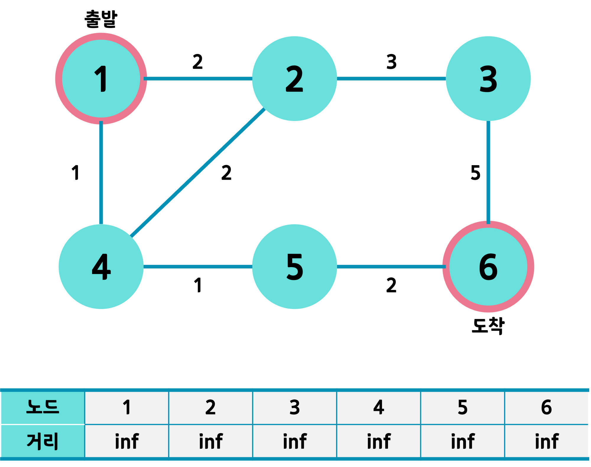
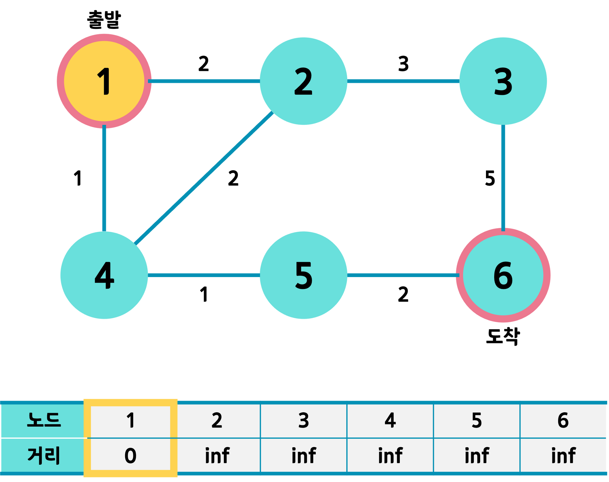
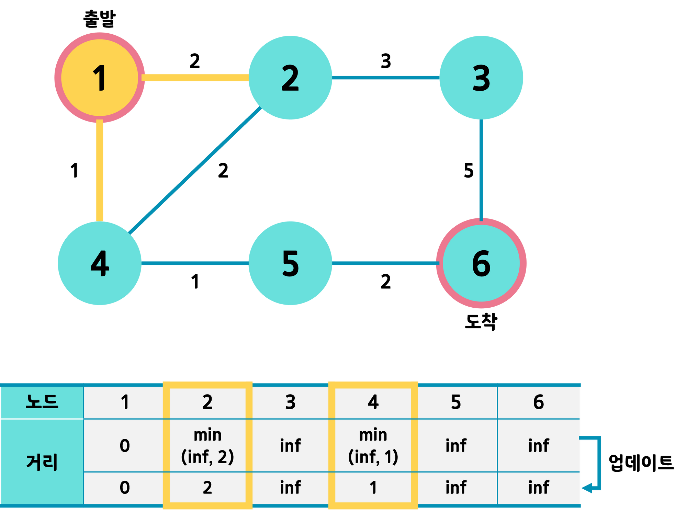
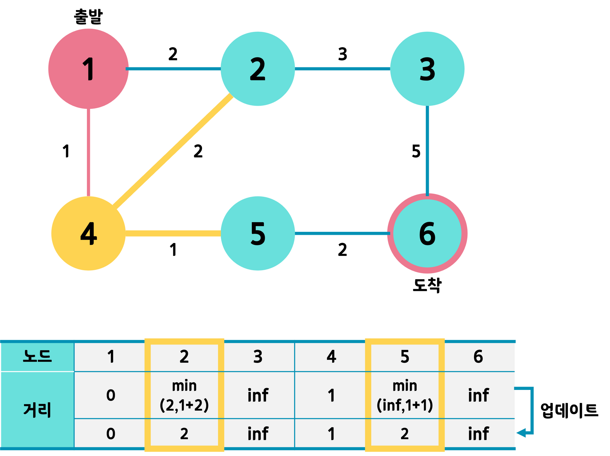
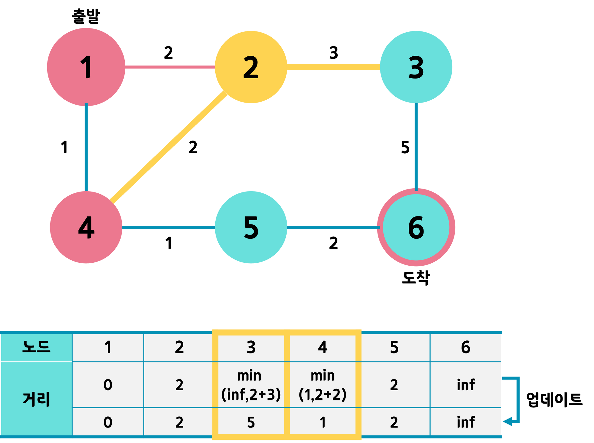
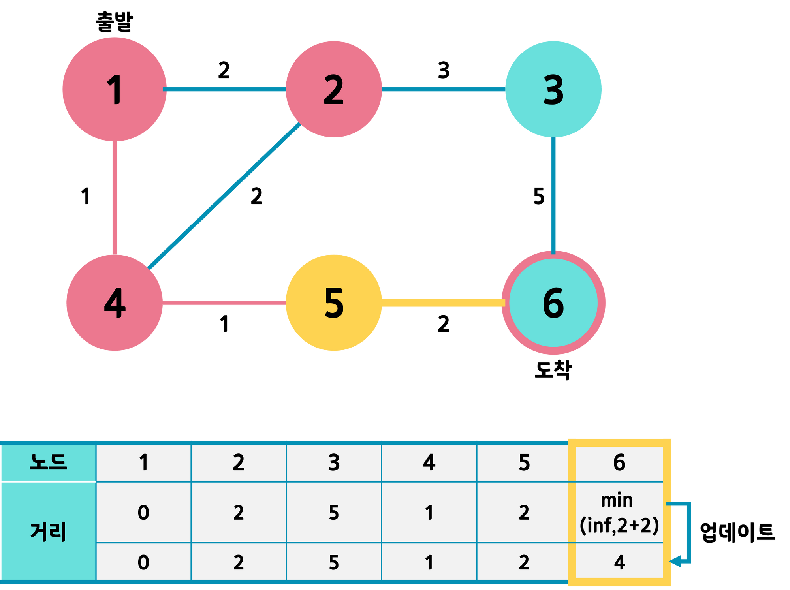
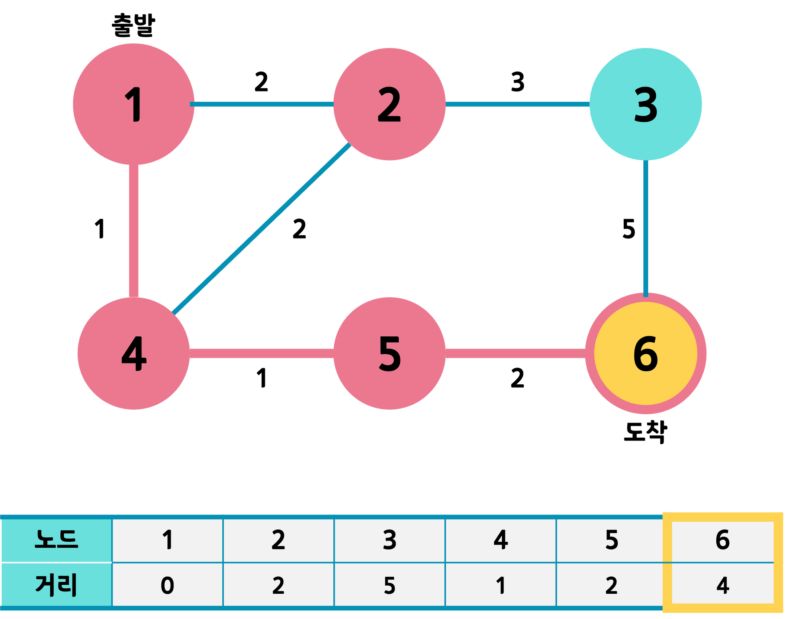
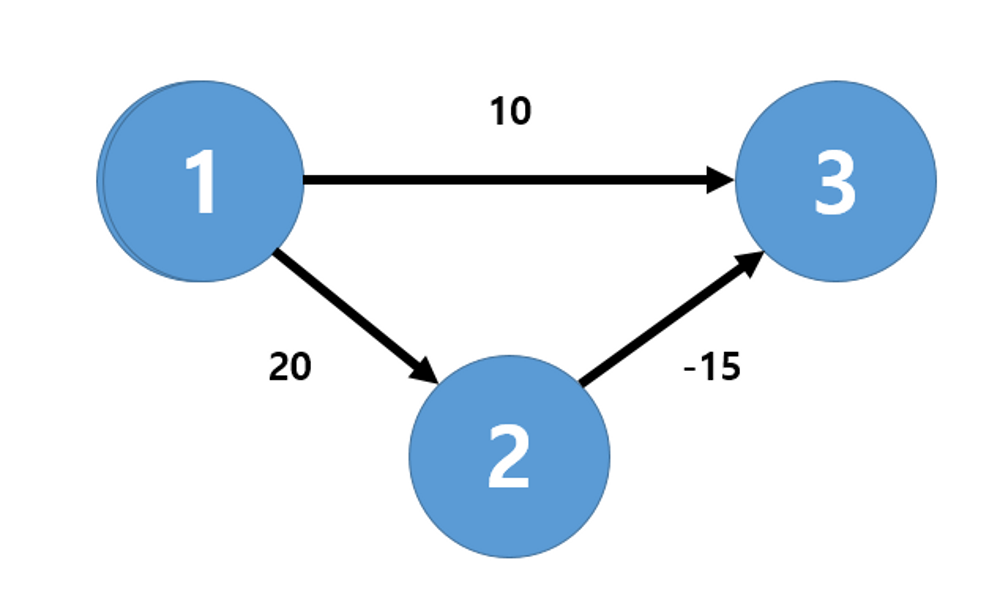

## 라우팅 알고리즘

### 정의

- 송신자로부터 수신자까지 데이터를 전송할때 어떤 라우터들을 통과해서 가야할지 경로를 선택하는 알고리즘
- 이 라우팅 알고리즘에 의해 라우팅 테이블이 구성됨

### 종류

**링크 상태 알고리즘(Link State)**

- 네트워크 토폴로지와 모든 링크 비용의 정보를 토대로, 노드로부터 다른 노드들의 최소 비용을 계산.
- N개의 노드가 있을때, N번을 반복하면서 각노드로까지의 최소 비용을 계산하는 알고리즘
- 대표적으로 다익스트라 알고리즘 사용

    
다익스트라 알고리즘

    

<h3>개요</h3>
다익스트라(dijkstra) 알고리즘은 그래프에서 한 정점(노드)에서 다른 정점까지의 최단 경로를 구하는 알고리즘 중 하나이다. 이 과정에서 도착 정점 뿐만 아니라 모든 다른 정점까지 최단 경로로 방문하며 각 정점까지의 최단 경로를 모두 찾게 된다. 매번 최단 경로의 정점을 선택해 탐색을 반복하는 것이다.

참고로 그래프 알고리즘 중 최소 비용을 구하는 데는 다익스트라 알고리즘 외에도 벨만-포드 알고리즘, 프로이드 워샬 알고리즘 등이 있다.

### 동작 단계

① 출발 노드와 도착 노드를 설정한다.

② '최단 거리 테이블'을 초기화한다.

③ 현재 위치한 노드의 인접 노드 중 방문하지 않은 노드를 구별하고, 방문하지 않은 노드 중 거리가 가장 짧은 노드를 선택한다. 그 노드를 방문 처리한다.

④ 해당 노드를 거쳐 다른 노드로 넘어가는 간선 비용(가중치)을 계산해 '최단 거리 테이블'을 업데이트한다.

⑤ ③~④의 과정을 반복한다.

'최단 거리 테이블'은 1차원 배열로, N개 노드까지 오는 데 필요한 최단 거리를 기록한다. N개(1부터 시작하는 노드 번호와 일치시키려면 N + 1개) 크기의 배열을 선언하고 큰 값을 넣어 초기화시킨다.

'노드 방문 여부 체크 배열'은 방문한 노드인지 아닌지 기록하기 위한 배열로, 크기는 '최단 거리 테이블'과 같다. 기본적으로는 `False`로 초기화하여 방문하지 않았음을 명시한다.

### 동작 예

출발 노드는 1번, 도착 노드는 6번이라 하고 거리 테이블을 전부 큰 값, 여기서는 inf(무한대)로 초기화했다. 각 노드들을 잇는 간선의 가중치 역시 표시했다.

출발 노드를 먼저 선택하고 거리를 0으로 한다.

1번 노드와 연결된 인접 노드는 2, 4이다. 그곳까지 가는 거리를 각각 기존의 거리값과 비교해 최솟값으로 업데이트한다. 가령 2의 경우 inf와 2 중 작은 값인 2를 택해 할당한다.

또한 인접 노드까지의 거리를 모두 업데이트한 1번 노드는 방문 표시를 한다.

최근 갱신한 테이블 기준, 방문하지 않는 노드 중 가장 거리값이 작은 번호를 다음 노드로 택한다. 위 상태에서는 4번 노드이다.

4번 노드에서 같은 작업을 수행한다. 4번과 연결된 2, 5번까지 오는 거리를 계산한다. 가령 5의 경우엔 `4번까지 오는 데 필요한 거리` + `4->5 간선의 가중치` 값인 2와 기존의 값인 inf 중 최솟값을 계산하고, 2번 노드의 경우엔 기존 값인 2와 4번을 거쳐가는 값인 1+2 = 3을 비교한다. 그렇다면 2번 노드는 기존 값이 더 크므로 업데이트하지 않는다. 즉, 1번에서 바로 2번으로 가는 것이 1->4를 거쳐 2번으로 가는 길보다 더 적게 걸린단 뜻이다.

다음으로 선택될 노드는 아직 방문하지 않은 노드 2, 3, 5, 6 중 거리값이 가장 작은 노드이므로 2 또는 5이다. 거리 값이 같다면 일단 인덱스가 작은 노드를 택한다고 하고 2번으로 가보자.

2번 노드와 연결된 3, 4번 노드에 대해 같은 과정을 반복한다.

그 다음 노드는 3, 5, 6번 중 가장 거리값이 작은 5번 노드가 되겠다.

5번 노드와 연결된 6번 노드에 같은 과정을 반복한다.

다음 노드를 선택해야 하는데, 아직 방문하지 않은 3번과 6번 중 거리값이 작은 것은 6번이다. 그런데 6번은 더 이어지는 노드도 없는데다 도착 노드이다. 따라서 알고리즘을 종료한다.

최종적으로는 1번에서 6번까지 오는 데 1 - 4 - 5 - 6의 경로를 거치고 최소 거리는 4가 된다.
    

  

**거리 벡터 알고리즘(Distance Vector)**

- 전체 네트워크 토폴로지는 알지 못하고, 본인이 가진 정보와 이웃 라우터의 갱신정보를 가지고 최소비용을 계산하는 알고리즘
- 경로의 비용에 변화가 있을 경우, 이웃에게 새로운 거리 비용이 담긴 벡터를 보냄으로서 정보를 고쳐나감
- 비동기적이고 반복적으로 변화가 없을때까지 수행
- 대표적으로 벨만포드 알고리즘 사용

    
벨만포드 알고리즘

    

<h3>개요</h3>
<ul>
<li>벨만포드 알고리즘은 한 노드에서 다른 노드까지의 최단 거리를 구하는 알고리즘</li>
<li>간선의 가중치가 음수일 때도 최단 거리를 구할 수 있음**</li>
</ul>

### 벨만-포드 vs 다익스트라

- `다익스트라 알고리즘`을 사용하게 되면 매번 방문하지 않은 노드 중에서 최단 거리가 가장 짧은 노드를 선택하므로 `1번 -> 3번(cost:10)`의 경로를 선택하게 된다. 이처럼 음수 간선이 존재하면 최단 거리를 찾을 수 없는 상황이 발생
- 반면에 `벨만-포드 알고리즘`을 사용하게 되면 매번 모든 간선을 전부 확인하므로 `1번 -> 2번 -> 3번(cost:20-15=5)`의 경로를 선택하여, 최단 거리를 찾을 수 있음

정리하자면,

**[다익스트라 알고리즘]**

- **매번 방문하지 않은 노드 중에서 최단 거리가 가장 짧은 노드를 선택하여 한 단계씩 최단 거리를 구해 나감**
- 음수 간선이 없다면 최적의 해를 찾을 수 있음 (음수 간선이 있을 때는 최적의 해를 찾을 수 X)
- 시간 복잡도가 빠름 `(OElogV)` --> 개선된 다익스트라 알고리즘 (우선순위 큐 사용)

**[벨만-포드 알고리즘]**

- **(정점 - 1)번의 매 단계마다 모든 간선을 전부 확인하면서 모든 노드간의 최단 거리를 구해나감** (<-->`다익스트라`와 차이점은 매 반복마다 모든 간선을 확인한다는 것, `다익스트라`는 방문하지 않은 노드 중에서 최단 거리가 가장 가까운 노드만을 방문)
    - 다익스트라 알고리즘에서의 최적의 해를 항상 포함
- 음수 간선이 있어도 최적의 해를 찾을 수 있음 (음수 간선의 순환을 감지할 수 있기 때문)
- 시간 복잡도가 느리다. `O(VE)`

### 벨만-포드 알고리즘 수행과정

1. 출발 노드를 설정
2. 최단 거리 테이블을 초기화
3. 다음의 과정을 (V(=정점) - 1)번 반복
    1. 모든 간선 E개를 하나씩 확인
    2. 각 간선을 거쳐 다른 노드로 가는 비용을 계산하여 최단 거리 테이블을 갱신
- 만약 음수 간선 순환이 발생하는지 체크하고 싶다면 3번 과정을 한 번 더 수행
    

