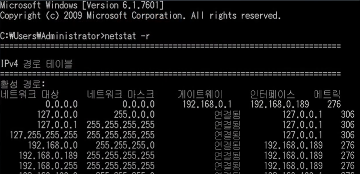

## 라우터와 라우팅

### 라우터
- 라우터란 둘 혹은 그 이상의 **네트워크와 네트워크 간 데이터 전송을 위해 최적 경로를 설정**해주며 데이터를 해당 경로를 따라 **한 통신망에서 다른 통신망으로 통신할 수 있도록 도와주는 인터넷 접속 장비**
- 내부 네트워크와 외부 네트워크를 연결해주는 장치
- 데이터들이 전송되는 경로(`route`)를 설정하는 장치(`router`)

### 라우팅

- **어떤 네트워크 안에서 통신 데이터를 보낼 때 최적의 경로를 선택하는 과정**
- 패킷이 목적지에 도달할 최적의 경로를 찾아 전송하는 것
- 라우터가 패킷을 목적지까지 전달할 수 있도록 하려면 라우터는 해당 목적지에 대한 경로 정보를 알고 있어야 하며, 이 정보에 따라 패킷을 전달
- **최적의 경로라 함은 주어진 데이터를 가장 짧거나 가장 빠른 시간 안에 전송할 수 있는 경로**
- **라우팅 프로토콜** : 라우터들은 목적지에 대한 경로 정보를 가지고 이웃의 라우터들과 경로 정보를 교환하는데, 이때 경로 정보(라우팅 정보)를 교환하는 프로토콜

## 라우팅 테이블

### 정의

- 목적지까지 갈 수 있는 모든 가능성있는 경로들 중에서 가장 효율적이라고 판단되는 경로 정보는 패킷을 전달할 때 바로 참고해서 사용할 수 있도록 따로 모아두는 공간
- 라우터가 패킷을 어디로 전송할지 경로를 결정하는 방법은 라우팅 테이블을 참조하여 결정함
- 라우터(Router)는 패킷의 목적지와 목적지를 가려면 어로 가야하는 지를 자신의 라우팅 테이블에 가지고 있고 패킷의 목적지 주소를 라우팅 테이블과 비교하여 어느 라우터에게 넘겨줄 지를 판단하게 됨
- 라우팅 프로토콜(Routing Protocol)의 가장 중요한 목적이 바로 라우팅 테이블 구성임
- netstat -r 명령어로 확인할 수 있음
