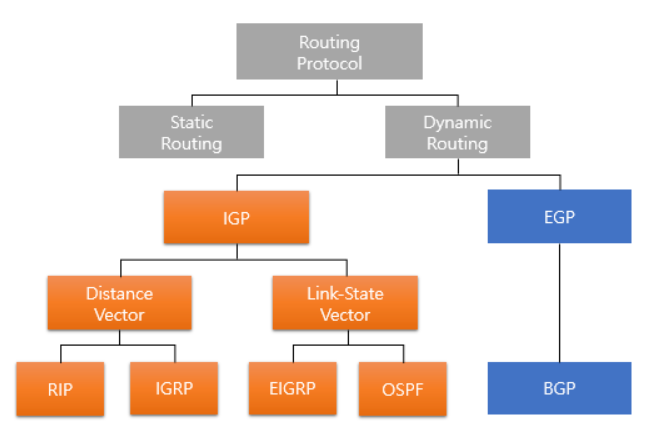

### 라우팅 프로토콜 종류

- 정적 라우팅 (static routing)

- 동적 라우팅 (dynamic routing) : RIP, IGRP, EIGRP, OSPF, BGF

- 라우팅 프로토콜 종류
  
  - 정적라우팅(Static routing)
    
    - 관리자에 의해 라우팅 테이블이 유지/관리 되는 기법
    
    - 라우팅 테이블을 교환하지 않고 라우팅이 가능하기 때문에 네트워크 대역폭을 절약 가능
    
    - 외부에 자신의 경로를 알리지 않기 때문에 보안에 강함
    
    - 경로에 문제가 생길 경우 대처하기 어렵다는 단점
  
  - 동적라우팅(Dynamic routing)
    
    - 라우팅 프로토콜에 의해 자동으로 라우팅 테이블을 구성하는 기법
    
    - 자동으로 경로가 결정되는 프로토콜
    
    - 라우터가 판단하여 가장 효율적인 방법으로 패킷을 전송시키는 방법
    
    - `RIP, IGRP, EIGRP, OSPF, BGP`
    
    - 내부라우팅(Inner Gateway Protocol)과 외부라우팅(External Gateway Protocol)로 나뉨
      
      - 내부라우팅 (IGP)
        
        - 같은 AS 내부의 라우팅 정보를 교환하는 프로토콜
          
          - AS(Autonomous system)
            
            - 하나의 그룹/기관/회사와 같이 동일한 라우팅 정책으로 하나의 관리자에 의해 운영되는 네트워크
        
        - `RIP, IGRP, EIGRP, OSPF`
        
        - Distance Vector Algorithm과 Link State Algorithm으로 나뉨
          
          - Distance Vector Algorithm
            
            - 라우터 간, 특정 네트워크까지의 거리(Distance)와 방향(Vector)를 교환하여 라우팅
            
            - `RIP, IGRP`
          
          - Link State Algorithm
            
            - 라우터 간, 전체 Network Topology 연결상태(Link State)를 교환하여 라우팅
            
            - `EIGRP, OSPF`
      
      - 외부라우팅 (EGP)
        
        - 다른 AS 간의 라우팅 정보를 교환(다른 AS와 연결)하는 프로토콜
        
        - `BGP`
