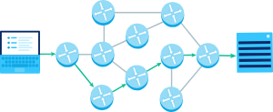

### 라우팅과 포워딩

- 네트워크 계층의 가장 큰 역할

- 라우팅
  
  - 출발지에서 목적지까지의 경로를 결정하는 것

- 포워딩
  
  - 라우터의 입력 포트에서 출력 포트로 패킷을 이동시키는 것

- 라우팅과 포워딩
  
  - 네트워크 계층(Network layer)에 반드시 있어야 하는 두 가지 기능
    
    - 네트워크 계층
      
      - 데이터를 목적지까지 가장 안전하고 빠르게 전달하는 계층
  
  - 라우팅
    
    - 출발지에서 목적지까지의 경로를 결정하는 것
  
  - 포워딩
    
    - 라우터의 입력 포트에서 출력 포트로 패킷을 이동시키는 것
    
    - 라우팅 테이블에 적힌 목적지 주소에 대응된 출력 포트로 패킷을 이동시키는 작업
  
  - 라우팅 테이블
    
    - 라우팅 알고리즘를 저장해둔 것
    
    - 이 테이블을 참조하여 포워딩이 이루어짐
    
    - 네트워크 상태변화(연결이 끊어진 경우나 경로의 비용/속도가 변한 경우)에 따라 갱신되어야 함
    
    - 최소 두 가지 정보 포함
      
      - 목적지의 주소 (Ethernet에서는 IP Address)
      
      - 출력포트 또는 출력링크
    
    - 윈도우 명령 프롬프트에서 `netstat -r`을 통해 확인
  
  - 라우팅 알고리즘
    
    - 네트워크에서 출발지부터 목적지까지 데이터를 보낼 수 있는 경로 중 하나를 선택하는 것
    
    - 보통은 비용이 가장 적게 드는 (가장 빨리 전송할 수 있는) 경로
